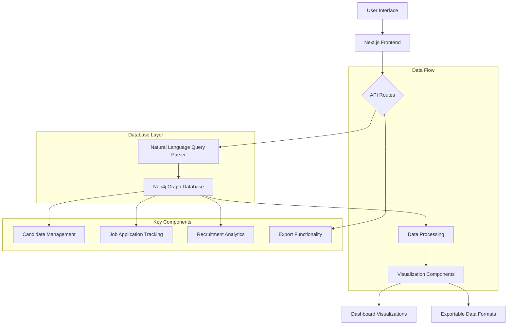
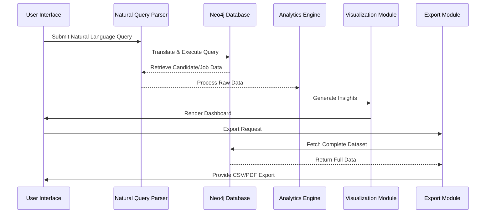
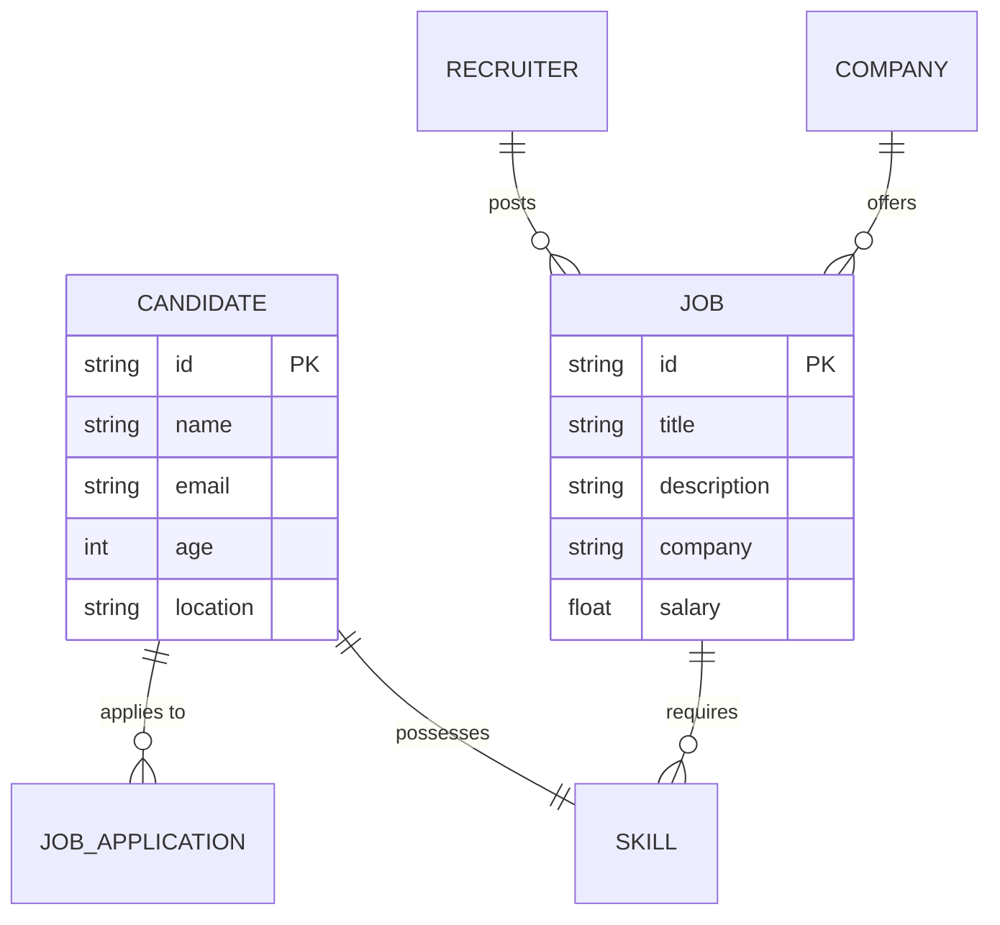

# Smart Recruitment Insight Platform

## 🚀 Overview
Advanced recruitment platform leveraging Next.js and Neo4j to provide deep insights into candidate data, job applications, and recruitment analytics.

## 🔍 System Architecture



## 🔄 Data Flow Diagram



## 📊 Neo4j Graph Data Model



## ✨ Features
- 🧠 Natural Language Query Interface
- 📋 Candidate Dashboard
- 📊 Top Job Seekers Visualization
- 📥 Data Export Capabilities
- 🔍 Advanced Filtering

## 🛠 Technology Stack
- Next.js 14
- React
- Neo4j
- Recharts
- Tailwind CSS
- Docker
- TypeScript

## 📋 Prerequisites
- Node.js 18+
- Docker
- Docker Compose
- Neo4j

## 🚢 Containerization

### Quick Start
```bash
# Clone the repository
git clone https://github.com/ajeetraina/smart-recruitment-insight.git

# Navigate to project directory
cd smart-recruitment-insight

# Build and start services
docker-compose up --build

# Stop services
docker-compose down
```

### Services
- **App**: Next.js Application (http://localhost:3000)
- **Neo4j**: Graph Database (http://localhost:7474)
- **Adminer**: Database Management (http://localhost:8080)

## 🔧 Local Development Setup

### Install Dependencies
```bash
npm install
# or
yarn install
```

### Configure Environment
Create a `.env` file:
```
NEO4J_URI=bolt://localhost:7687
NEO4J_USERNAME=neo4j
NEO4J_PASSWORD=your_password
```

### Run Development Server
```bash
npm run dev
# or
yarn dev
```

## 🤝 Contributing
1. Fork the repository
2. Create a feature branch
3. Commit your changes
4. Push to the branch
5. Create a Pull Request

## 📄 License
MIT License

## 🌟 Star the Project
If you find this project useful, please give it a star! ⭐
