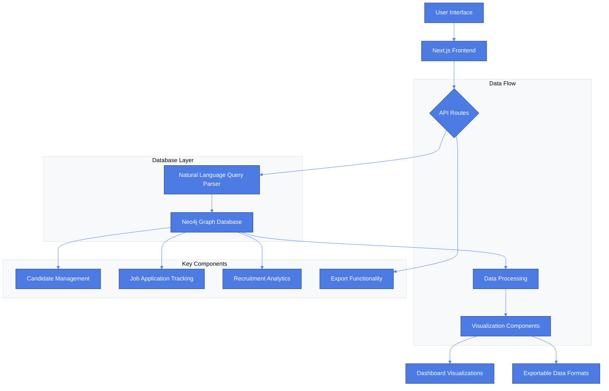
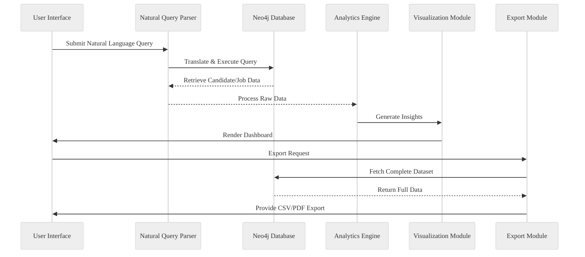
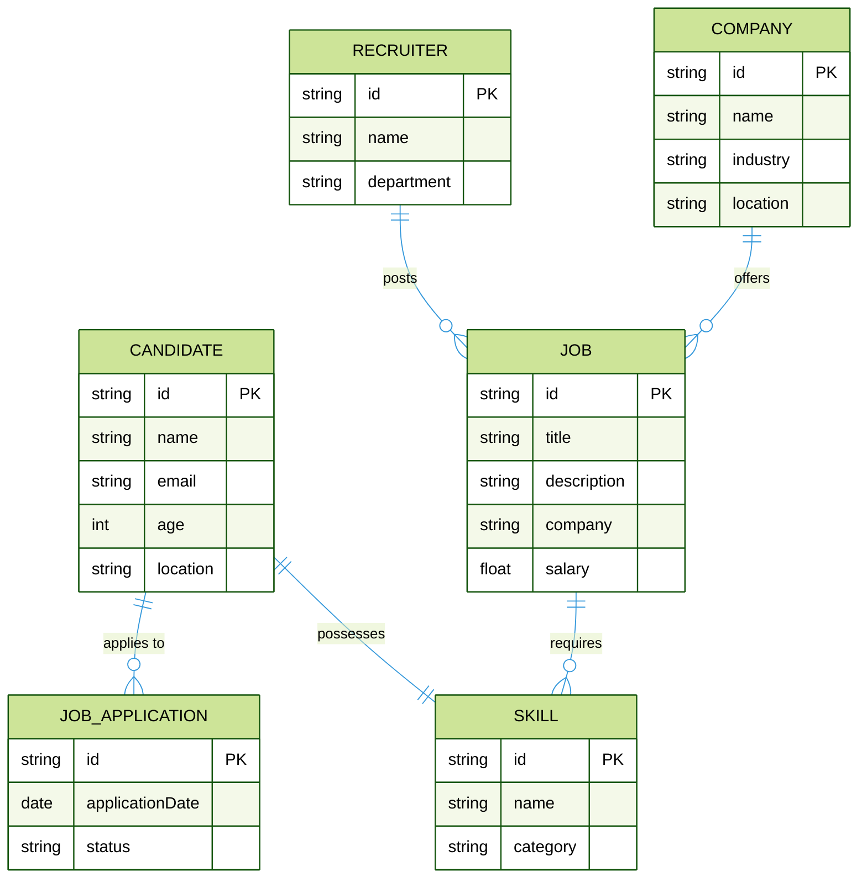

# Smart Recruitment Insight Platform

## Overview
A cutting-edge recruitment platform leveraging Next.js and Neo4j to provide deep insights into candidate data, job applications, and recruitment analytics.

## System Architecture



## Data Flow Diagram



## Neo4j Graph Data Model



## Features
- Natural Language Query Interface
- Candidate Dashboard
- Top Job Seekers Visualization
- Data Export Capabilities
- Advanced Filtering

## Prerequisites
- Node.js (v18+)
- Neo4j Desktop or Cloud Instance
- npm or yarn

## Setup Instructions

### 1. Clone the Repository
```bash
git clone https://github.com/ajeetraina/smart-recruitment-insight.git
cd smart-recruitment-insight
```

### 2. Install Dependencies
```bash
npm install
# or
yarn install
```

### 3. Configure Neo4j Connection
Create a `.env` file in the root directory:
```
NEO4J_URI=bolt://localhost:7687
NEO4J_USERNAME=neo4j
NEO4J_PASSWORD=your_password
```

### 4. Run Development Server
```bash
npm run dev
# or
yarn dev
```

## Key Technologies
- Next.js 14
- React
- Neo4j
- Recharts
- Tailwind CSS

## Deployment
Easily deployable on Vercel, Netlify, or any Node.js-supported platform.

## Contributing
1. Fork the repository
2. Create your feature branch
3. Commit your changes
4. Push to the branch
5. Create a new Pull Request

## License
MIT License
